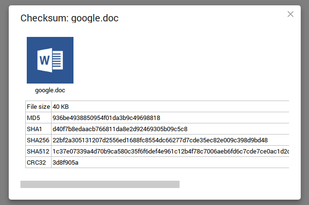

# FileRun Plugin: Checksum
Plugin for [FileRun](https://www.filerun.com/) to create hashes of files.

# Installation
- Copy the "checksum" folder inside your FileRun installation folder's "customizables/plugins" folder.
- You might need to clear your browser's cache to see the new "Open with.." option. (Simply press Ctrl+F5 works for me)
